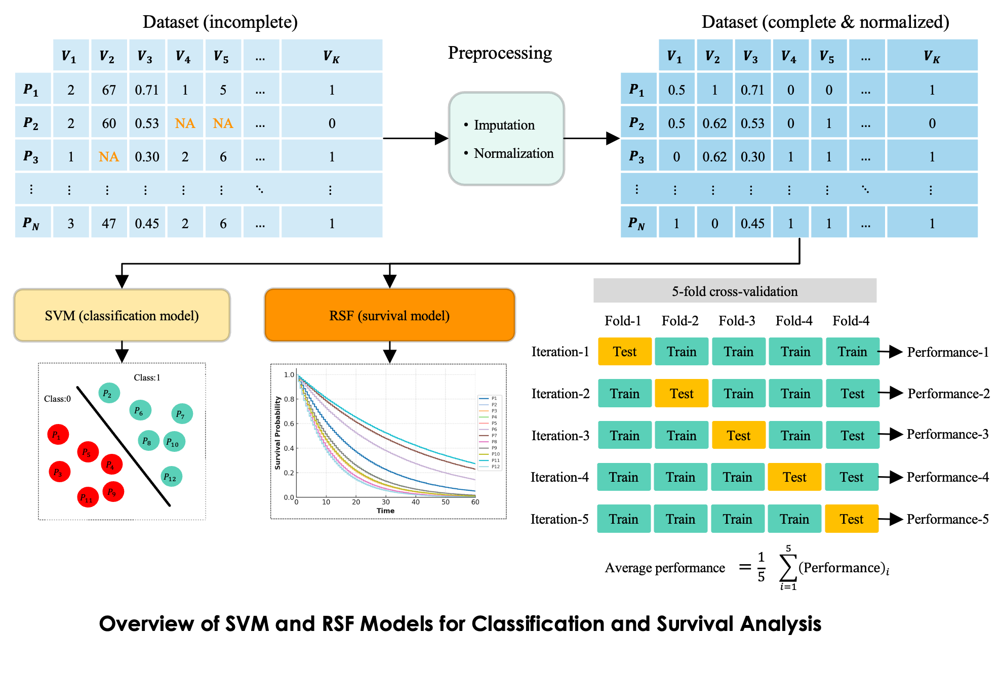

# SVM and RSF Pipeline for Clinical Data Analysis



<p align="justify"> This pipeline provides a general framework for analyzing clinical data using both classification and survival analysis models. It begins with constructing a feature matrix, where each row corresponds to a patient and each column represents a clinical variable. Missing values are addressed through imputation, and features are normalized to ensure comparability. The processed data is then used to train two types of models: a classification model-Support Vector Machine, and a survival model-Random Survival Forest, to estimate individual survival probabilities over time. Model performance is evaluated using 5-fold cross-validation, ensuring reliability and generalizability across subsets of the data. This flexible pipeline supports a wide range of clinical prediction tasks, from risk group classification to time-to-event forecasting. </p>

# Setting Up the Pipeline:

1. System requirements:
- Ubuntu, Windows, Mac
- Python version >= 3.9 (using conda environments)
- Anaconda version >= 23.7.4
2. Steps to Set Up the Pipeline:
- Download the pipeline to your Desktop
- Navigate to the downloaded pipeline folder
- Open Terminal then navigate to pipeline folder  `cd path/to/pipeline/folder`
- Create a conda environment:
`conda create -n SVM-RSF python=3.9`

- Activate the environment:
  `conda activate SVM-RSF`

- Install required packages:
  `pip install -r requirements.txt`


# 1. Dataset:

<p align="justify"> Prepare your dataset in Excel files and place them in the `/data` folder — one file for the SVM model and one for the RSF model. For the SVM file, the first column should contain patient IDs, followed by clinical variables as columns, and the last column must contain the classification label (e.g., 0: negative, 1: positive). For the RSF file, the structure is similar: the first column is the patient ID, followed by clinical variables, with the last two columns as "time" and "event" (e.g., [Survival_month, Survival_status]). Example files for both formats are provided in the `/data` folder.</p>

# 2. Preprocessing:

The preprocessing consists of the following steps:
- Data Imputation - Missing values are handled using two strategies:
  - MICE (Multiple Imputation by Chained Equations): Estimates missing values based on relationships between variables.
  - Constant Imputation: Replaces missing values with a fixed value (e.g., 0 or a specific value)
- Data Normalization:
After imputation, all features are normalized to ensure they are on a consistent scale. This prevents variables with larger ranges from dominating the learning process and helps improve model training and performance. Two normalization strategies are used:
  - Z-score scaling: Transforms features to have zero mean and unit variance, useful for models that assume Gaussian-like distributions.
  - Min-max scaling: Rescales features to a fixed range, typically [0, 1], preserving relative relationships and improving performance for distance-based models.


To preprocess the data for SVM, run the following command:
```bash
python pre-processing.py \
  --input_dir data/SVM_data.xlsx \
  --output_dir output \
  --features_to_normalize Sex CTPs Nodule_No Multinodular_tumor BCLC Age BMI MTD ALT AST ALP ALB Bili WCC Hb Neu Lym PLT CRP AFP ALBIs ALBIg \
  --scaling_method MinMaxScaler \
  --imputation_method MICE \
  --replace_val -1 \
  --add_indicator False \
  --do_norm True
```
Notes: 
- When using `MinMaxScaler`, you need to manually specify only the features that require normalization, as some features may already be in the [0, 1] range and re-scaling them could distort their values. In contrast, when using Z-score normalization (StandardScaler), all features should be normalized regardless of their original range, so you should provide the full list of feature names.
- Choose the scaling method by setting `--scaling_method` to either `MinMaxScaler` or `StandardScaler`.
- Select the imputation method by setting `--imputation_method` to either `MICE` or `const`.
- Set `--replace_val` to specify a constant value for replacing missing entries (default is -1).
- Add a missing-value indicator column by setting `--add_indicator` to True.
- Enable feature normalization by setting `--do_norm` to True; set to False to skip normalization.

To preprocess the data for RSF, run the same command as before but change the input file to `--input_dir data/RSF_data.xlsx` and set `--do_norm` to False. Normalization is not required for RSF.

# 3. SVM:

After preprocessing your dataset, you can train and evaluate the SVM classifier using the `SVM.py` script. This script accepts several configurable parameters for tuning and experimentation.
```bash
python SVM.py \
  --dataset output/feature_filled_norm.xlsx \
  --output_dir output \
  --kernel_fn rbf \
  --C 1.0 \
  --gamma 0.55
```
Notes:
- Set `--dataset` to the path of the preprocessed Excel file you want to use for training and evaluation (e.g., output/feature_filled_norm.xlsx).
- Set `--output_dir` to define where the model’s results will be saved (defalut is `output`)
- Choose the SVM kernel by setting `--kernel_fn` to one of the following options: linear, rbf, poly, or sigmoid (default is rbf).
- Control the regularization strength using `--C` (default is 1.0).
- Set `--gamma` to define the kernel coefficient. Acceptable values include 'scale', 'auto', or a float ( default is 0.55).
- Outputs: the outputs are [ROC Curve](https://en.wikipedia.org/wiki/Receiver_operating_characteristic), precesion-recall curve, calbiration curve, and classification metrics (ACC,recall, precision, and F1).


# 4. RSF:
After preprocessing your dataset, you can train and evaluate the RSF predictor  using the `RSF.py` script. This script accepts several configurable parameters for tuning and experimentation.
```bash
python RSF.py \
  --dataset output/feature_filled_norm.xlsx \
  --output_dir output \
  --lts 15 \
  --t_calb 36 \
  --t_youden 24 \
  --n_estimators 300 \
  --min_samples_split 10 \
  --min_samples_leaf 10 \
  --max_features sqrt \
  --n_splits 5
```
Notes:
- Set `--dataset` to the path of the preprocessed Excel file containing survival data (e.g., output/feature_filled_norm.xlsx).
- Set `--output_dir` to specify where the results will be saved.
- Use `--lts` to define the time (in months) up to which the number of deaths will be counted.
- Use `--t_calb` to set the time point (in months) at which calibration plots will be computed.
- Use `--t_youden` to define the time (in months) at which the Youden Index is calculated to find an optimal risk threshold.
- Set `--n_estimators` to define the number of trees in the Random Survival Forest (default is 300).
- Use `--min_samples_split` to control the minimum number of samples required to split an internal node (default is 10).
- Use `--min_samples_leaf` to set the minimum number of samples required at a leaf node (default is 10).
- Set `--max_features` to specify the number of features to consider when looking for the best split. Accepts options like "sqrt", "log2", or a float (e.g., 0.5 for 50% of features).
- Use `--n_splits` to define how many folds to use for cross-validation when evaluating the model (default is 5).


# Contact:

If you have any questions or comments, please feel free to contact: falah.rahim@unn.no


